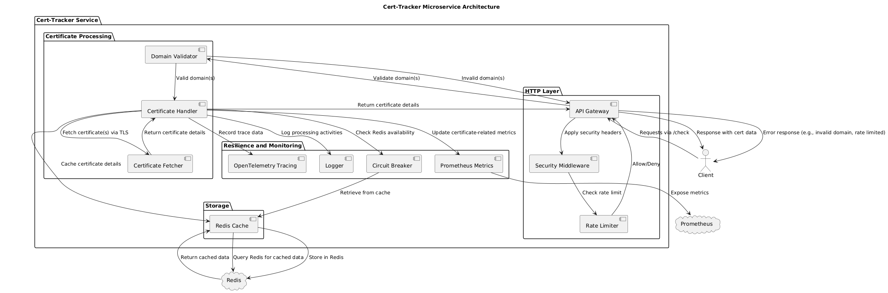
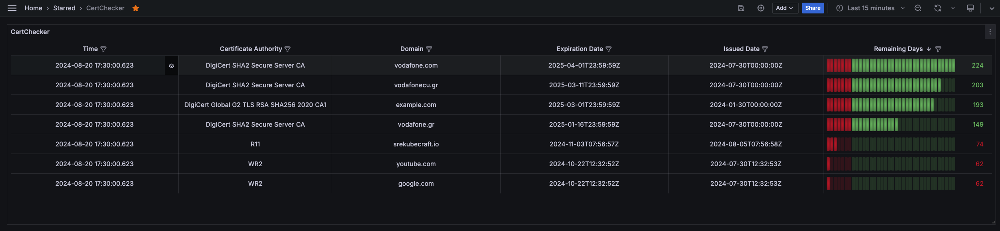

# Cert-Tracker Microservice Documentation

### Overview

Cert-Tracker is a microservice designed to monitor SSL certificate expiration across multiple domains. It retrieves SSL certificate details, processes the information, caches the results in Redis, and exposes these details through API endpoints. This service is critical for maintaining the health and security of web-facing services by providing timely updates on SSL certificates' status and tracking certificate expiry for potential renewal.

Cert-Tracker is deployed as part of a broader microservices architecture and integrates with Prometheus for monitoring, Redis for caching, and supports distributed tracing via OpenTelemetry. The service is optimized for resilience and performance, utilizing rate limiting, circuit breakers, structured logging, and retry strategies for external service communication.

### Architecture

### Flow Explanation:

1. **Client Interaction:** The client interacts with the service through the `/check` endpoint. The client can request certificate details for multiple domains via a POST or fetch a single domain's certificate details using `GET`.
2. **Domain Validation:** The service performs domain validation to ensure the input conforms to expected domain formats.
3. **Certificate Retrieval:** Cert-Tracker retrieves SSL certificate information using `tls.Dial`, processing and extracting key details such as expiration date, issued date, and the certificate authority.
4. **Redis Caching:** Retrieved certificate details are stored in Redis to optimize performance and prevent redundant processing for frequently queried domains.
5. **Metrics Reporting:** Cert-Tracker reports certificate-related metrics (e.g., days until expiry, certificate authority, and status) to Prometheus, enabling external monitoring systems to alert if a certificate is nearing expiration.
6. **Tracing and Logging:** The service implements distributed tracing (via OpenTelemetry) and structured logging to provide insights into request flows and any issues encountered during processing.

### Grafana Dashboard

